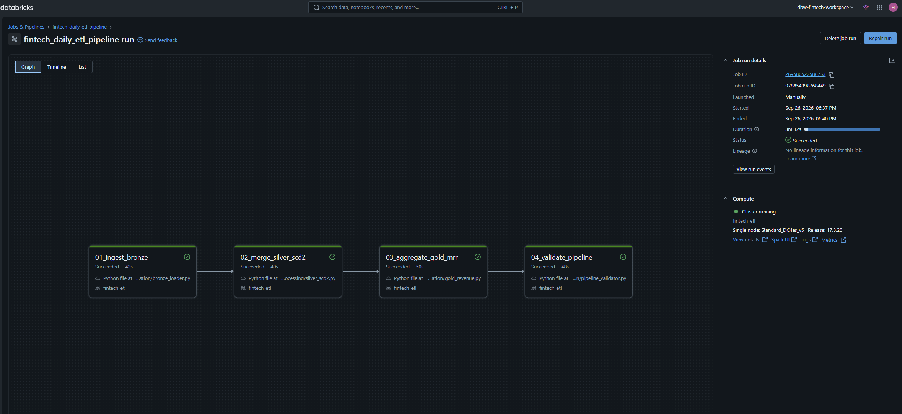
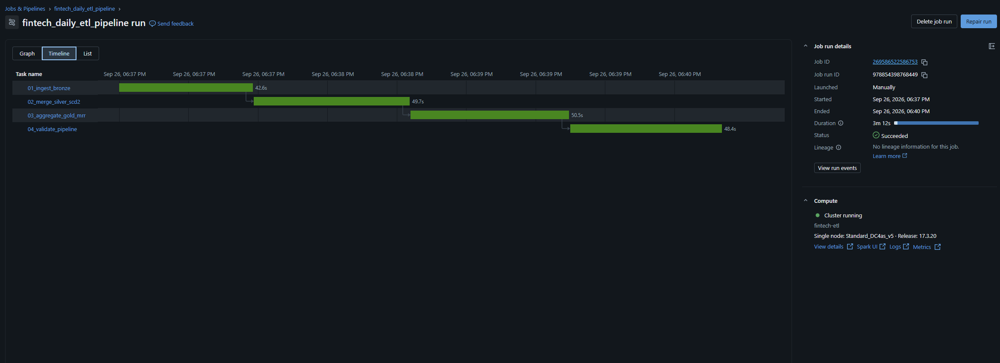
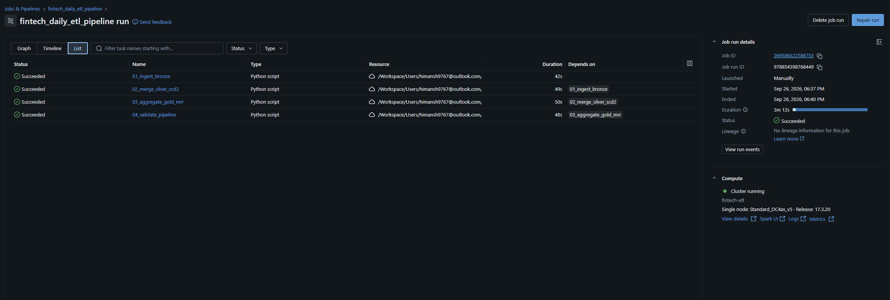
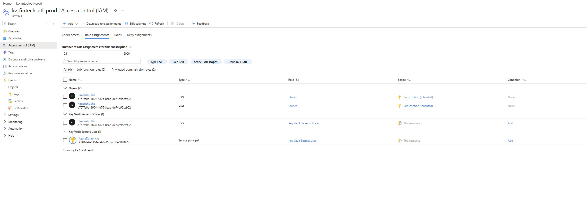
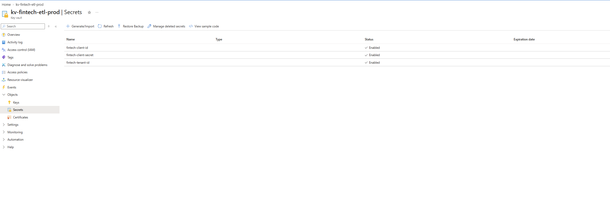
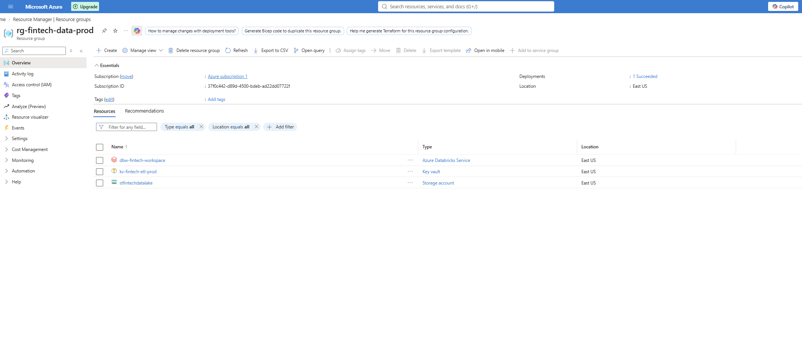
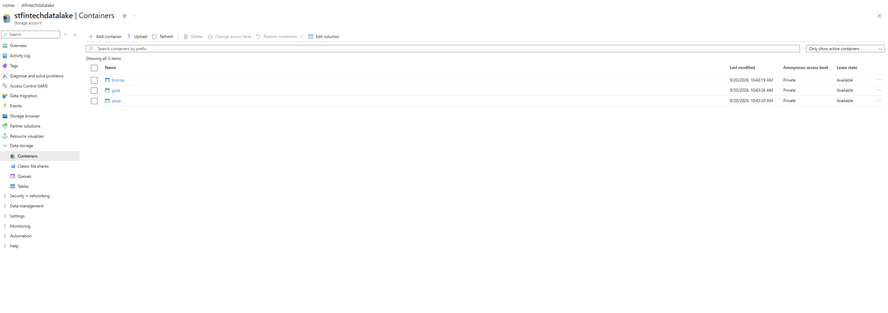
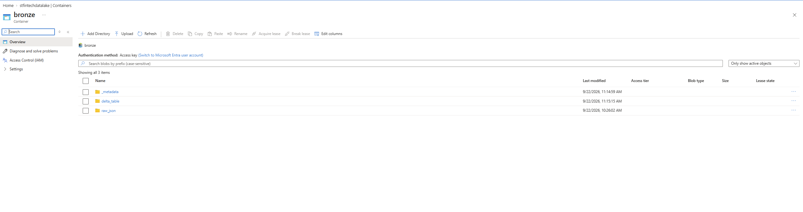
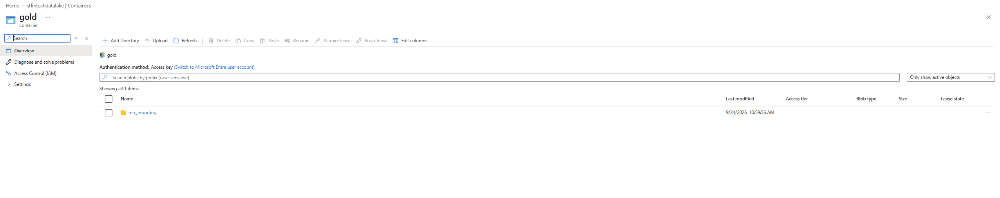
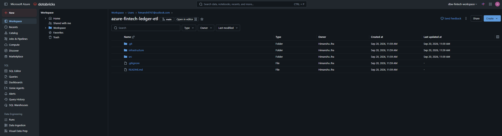

# 🚀 Enterprise Fintech Data Pipeline: Azure Medallion Architecture

     

> **Business Objective:** Engineered a secure, scalable, and fully automated data pipeline to ingest streaming Fintech subscription events, track historical dimension changes (SCD Type 2), and aggregate Monthly Recurring Revenue (MRR) for executive BI dashboards.

## 📊 Data Quality & Pipeline Observability

To guarantee data integrity, a custom PySpark observability script runs as the final automated task. It validates exact record counts, schema integrity, and MRR calculations across all Medallion layers before downstream BI tools refresh.

<div align="center">
  
  <p><i>Automated terminal output proving successful execution and accurate MRR aggregations.</i></p>
</div>

---

## 🏗️ Architecture & Orchestration

This pipeline transforms raw JSON events into business-ready insights using the **Medallion Architecture**, orchestrated entirely via **Databricks Workflows**.

| Layer | Component | Technical Implementation & Purpose |
| :--- | :--- | :--- |
| 🥉 **Bronze** | Databricks Auto Loader | Ingests streaming raw JSON incrementally. Executed as a transient micro-batch (`trigger(availableNow=True)`) to drastically minimize DBU compute costs. |
| 🥈 **Silver** | PySpark Delta Merge | Implements an **SCD Type 2** architecture using the efficient "Null Merge Key" pattern to track historical user upgrades/downgrades. Deduplicates source rows using PySpark Window functions to prevent Delta Merge conflicts. |
| 🥇 **Gold** | PySpark Aggregation | Applies business logic to calculate tier-based MRR. Physically sorts data on disk using `OPTIMIZE` and `ZORDER BY` to guarantee sub-second Power BI query performance. |

### Automated Job Clusters & DAGs
Scripts are decoupled from interactive notebooks into modular `.py` files. Orchestration relies on automated **Databricks Job Clusters** that spin up solely for execution and terminate immediately, reducing cloud compute costs by roughly 50%.

<div align="center">
  
  <p><i>The visual DAG illustrating the sequential dependency of the Bronze, Silver, Gold, and Validation tasks.</i></p>
</div>

<div align="center">
  
  
  <p><i>Workflow timeline and list execution views proving successful, performant runtime metrics.</i></p>
</div>

---

## 🧠 Core Engineering Achievements

This project bypasses basic notebook tutorials to implement the strict standards required in production, zero-trust enterprise environments.

### 🛡️ 1. Zero-Trust Security & Credential Management
Zero hardcoded passwords. The PySpark cluster authenticates directly to Azure Data Lake Storage (ADLS Gen2) using a Service Principal dynamically fetched from an **Azure Key Vault Secret Scope**. 

<div align="center">
  
  
  <p><i>Explicit IAM Role Assignments (Key Vault Secrets User) and securely stored Service Principal credentials.</i></p>
</div>

### 🏗️ 2. Infrastructure as Code (IaC) & Cloud Storage
All Azure resources were provisioned immutably using **Terraform**. The data lake is built on ADLS Gen2 with Hierarchical Namespace enabled for optimal big data processing.

<div align="center">
  
  <p><i>The core Azure infrastructure provisioned via Terraform, including the Databricks Workspace, Key Vault, and Storage Account.</i></p>
</div>

<div align="center">
  
  <p><i>The root ADLS Gen2 Storage Account partitioned into Medallion architecture containers.</i></p>
</div>

<div align="center">
  
  
  <p><i>Internal view of the Bronze (raw ingest/metadata) and Gold (MRR reporting) Delta Lake directories.</i></p>
</div>

### ⚙️ 3. Idempotency & Eager Evaluation
The pipeline handles its own state and can be rerun infinitely without data duplication. Bypassing PySpark's default lazy evaluation, the transformation scripts use eager limits (`.limit(1).count()`) to detect missing metadata. They autonomously decide whether to execute an initial table build or a complex Delta Merge, ensuring the pipeline never fails on an empty directory.

### 🔄 4. Git Integration & CI/CD Readiness
The codebase is structured like a traditional software engineering project, leveraging Databricks Repos for version control rather than isolated workspace notebooks.

<div align="center">
  
  <p><i>Clean Git integration within the Databricks Workspace separating infrastructure logic from Python processing scripts.</i></p>
</div>

---

## 📂 Repository Structure

```text
├── images/                     # Pipeline architecture and execution screenshots
├── infrastructure/
│   ├── main.tf                 # Terraform definitions for Azure resources
│   └── variables.tf            # Variables and environment configurations
├── src/
│   ├── config/
│   │   └── spark_config.py     # Centralized Key Vault authentication module
│   ├── ingestion/
│   │   └── bronze_loader.py    # Auto Loader micro-batching script
│   ├── processing/
│   │   └── silver_scd2.py      # Idempotent SCD Type 2 merge logic
│   ├── aggregation/
│   │   └── gold_revenue.py     # MRR business logic and Z-Ordering
│   └── validation/
│       └── pipeline_validator.py # Data observability and integrity checks
└── README.md


## 🚀 How to Run
1. Deploy Infrastructure: Navigate to /infrastructure and run terraform init -> terraform apply.

2. Configure IAM: Grant your Databricks App Service the Key Vault Secrets User and Storage Blob Data Contributor roles in Azure.

3. Orchestrate: Sync this repository to Databricks Repos. Create a Databricks Workflow chaining the Python scripts sequentially on a Job Cluster.

4. Validate: The workflow automatically runs pipeline_validator.py to confirm data integrity upon completion.